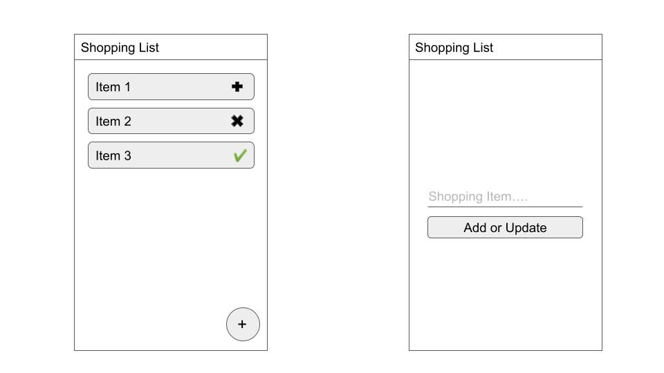

# README
Feel free to fork and use it as tutorial. Don't forget to give it a ⭐️

## Branches

`master`: project base

`insert-update`: insert shopping item and update shopping_item's item_state operation

`final`: complete project's branch, insert, update, and delete operation.

slides:
https://docs.google.com/presentation/d/e/2PACX-1vTYQdCGq70Xh3UuelBgiuTYjWExGtXX6k0BUeSoJ5MfI9cEaAaDU1H4E9QYTRVKWBNWk6WhB0Rwnlrf/pub?start=false&loop=false&delayms=3000

article:
https://medium.com/@andiwijayaid/belajar-room-db-mvvm-coroutines-livedata-7fe4ebf771de
